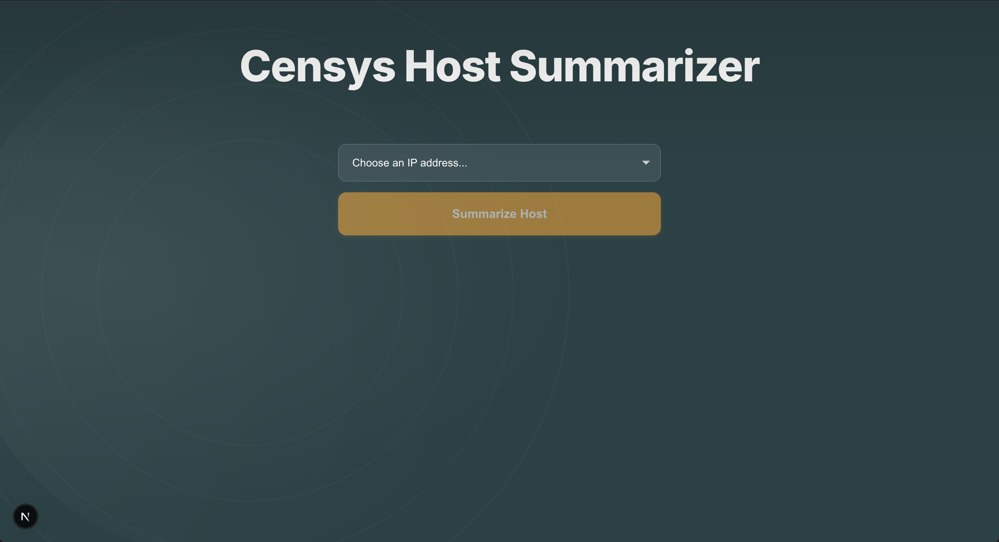
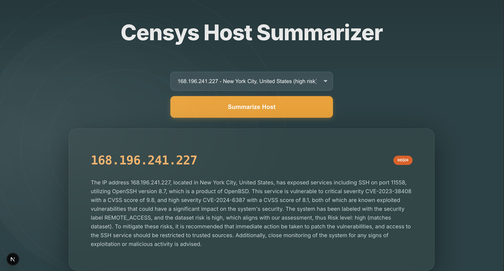

# Censys Host Summarizer

An AI-powered app that takes raw Censys host data and turns it into clear, readable summaries. Built with **FastAPI** + **React**, powered by Groq’s `llama-3.3-70b` model.

---

## Live Demo

- Frontend: [https://censys-project.vercel.app](https://censys-project.vercel.app)
- Backend API & Docs: [https://censys-project.onrender.com/docs](https://censys-project.onrender.com/docs)

### Note on Startup Time
The backend is hosted on Render’s free tier.  
If it has been inactive for ~15 minutes, the **first request may take up to 60 seconds** while the service spins back up.  
After that, all requests are immediate. If you experience a delay, please wait a moment and retry.

---

## Picture Demo

Here’s a quick look at the application in action.

### Landing Page

### Host Summary Generation

---

## Instructions on How to Run the Project

### Backend (FastAPI)
cd backend  
pip install -r requirements.txt  
uvicorn main:app --reload --port 8000  

### Frontend (React + Vite)
cd frontend  
npm install  
npm run dev  

Open the app at http://localhost:3000.  
(or http://localhost:5173 if your local dev server runs on that port).

---

## Environment Setup

### Backend (.env)
GROQ_API_KEY=your_groq_api_key_here  
GROQ_MODEL=llama-3.3-70b  

### Frontend (.env.local)
VITE_API_BASE_URL=http://localhost:8000  

---

## Assumptions Made During Development
- The provided `hosts_dataset.json` is representative of the data format used by Censys.  
- Summaries only need to be concise (3–5 sentences) and highlight IP, services, vulnerabilities, and risk level.  
- Risk levels provided in the dataset are authoritative and used directly in the summaries.  
- Frontend dropdown uses a static list for now; in a production system this would be dynamic.  
- Backend uses Groq `llama-3.3-70b` model for summarization, but can be swapped for another LLM with minimal changes.  

---

## Testing Instructions

### Manual Testing
1. Run the backend and frontend as described above.  
2. Open http://localhost:3000.  (or http://localhost:5173 if your local dev server runs on that port).
3. Select a host IP from the dropdown.  
4. Click "Summarize Host".  
5. Verify that the summary includes IP, location, services, vulnerabilities, and overall risk level.  

### Automated Testing
Backend tests (when added):  
cd backend && pytest  

Frontend tests (when added):  
cd frontend && npm run test  

---

## AI Techniques Implemented
- Prompt Engineering:  
  The host JSON is embedded into a structured prompt with explicit instructions:  
  - State IP and location.  
  - List exposed services with ports and versions.  
  - Highlight critical/high CVEs.  
  - Include malware/threat intel if present.  
  - Conclude with overall risk level.  

- LLM Integration:  
  Groq’s `llama-3.3-70b` is used to generate concise summaries from host JSON.  
  The backend isolates the summarization call so the model can be swapped with OpenAI or another provider if needed.  

---

## API Endpoints
- GET /hosts → Returns available hosts with location and risk level.  
- POST /summarize → Takes { ip } and returns { ip, summary }.  

---

## Future Enhancements
If given more time, I would:  
- Add support for additional Censys datasets (certificates, web properties).  
- Implement risk badges and lightweight data visualizations on the frontend.  
- Introduce caching to reduce repeated LLM calls and speed up responses.  
- Add user input validation and better error handling for robustness.  
- Expand automated test coverage for both backend and frontend.  
- Build a provider-agnostic backend layer to support Groq, OpenAI, or other LLMs seamlessly.  

---
